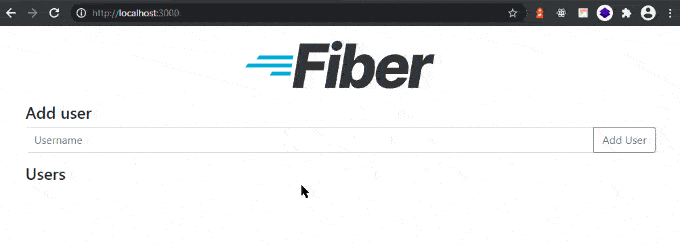

Adam Grant กล่าวไว้ว่า taker จะเป็นคนที่สร้าง negative impact ต่อองค์กรณ์ ซึ่งอาจมากถึง 2-3 เท่าของ positive impact ที่ giver สร้าง
(one bad apple can spoil a barrel, but one good egg just does not make a dozen)

giver สามารถให้ผลประโยชน์กับองค์กรณ์ได้เป็นอย่างดี แต่พอนานๆเข้า พวกเขาจะเกิดภาวะ burnout
เราจึงต้องป้องกันไม่ให้เกิดเหตุการณ์นี้ โดย Adam Rifkin มีอาวุธลับที่เรียกว่า five-minute favor
ซึ่งบอกไว้ว่าการจะเป็น giver ได้ง่ายๆเพียงแค่ทำสิ่งเล็กๆที่มีค่ามากๆให้กับผู้อื่น (find small ways to add large value to other people’s lives)
เช่นการแบ่งปันความรู้หรือให้ feedback เล็กๆน้อยๆ หรือเพียงแค่พูดประมาณ “You know, I’m going to try to figure out if I can recognize somebody whose work has gone unnoticed.”
ก็เป็นการให้กำลังใจ giver และปกป้องเขาได้แล้ว

https://singjupost.com/adam-grant-on-are-you-a-giver-or-a-taker-at-ted-talk-conference-transcript/?singlepage=1


# GoFiber Docker Boilerplate


[](https://gofiber.io/discord)


## IDE Development

### Visual Studio Code

Use the following plugins, in this boilerplate project:
- Nome: Go
  - ID: golang.go
  - Descrição: Rich Go language support for Visual Studio Code
  - Versão: 0.29.0
  - Editor: Go Team at Google
  - Link do Marketplace do VS: https://marketplace.visualstudio.com/items?itemName=golang.Go

## Development

### Start the application 


```bash
go run app.go
```

### Use local container

```
# Clean packages
make clean-packages

# Generate go.mod & go.sum files
make requeriments

# Generate docker image
make build

# Generate docker image with no cache
make build-no-cache

# Run the projec in a local container
make up

# Run local container in background
make up-silent

# Stop container
make stop

# Start container
make start
```

## Production

```bash
docker build -t gofiber .
docker run -d -p 3000:3000 gofiber
```

Go to http://localhost:3000:



